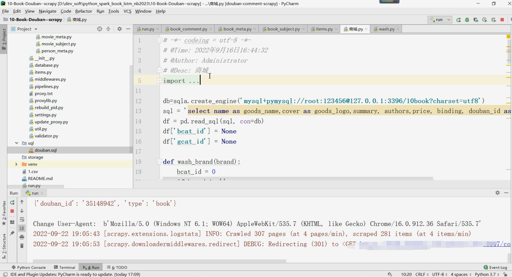

## 计算机毕业设计PyTroch+Spark+LSTM+Scrapy图书推荐系统 图书爬虫可视化 图书大数据 图书数据分析 大数据毕业设计

## 要求
### 源码有偿！一套(论文 PPT 源码+sql脚本+教程)

https://www.bilibili.com/video/BV1Td4y1z7P5?spm_id_from=333.999.0.0

### 
### 加好友前帮忙start一下，并备注github有偿获取源码
### 我的QQ号是2877135669或者 1679232425

# 

### 加qq好友说明（被部分 网友整得心力交瘁）：
    1.加好友务必按照格式备注
    2.避免浪费各自的时间！
    3.当“客服”不容易，repo 主是体面人，不爆粗，性格好，文明人。

## 开发技术

前端：vue.js、echarts、websocket

后端API:springboot+mybatis-plus

数据库：mysql

数据分析：Spark

机器学习：PyTroch（基于神经网络的混合CF推荐算法）、协同过滤算法(基于用户、基于物品全部实现)、lstm评论情感分析

第三方平台：支付宝沙箱支付、百度AI图片识别、短信接口

数据集：Scrapy爬虫框架(Python)

## 创新点

Spark大屏、爬虫、协同过滤推荐算法、PyTroch神经网络推荐算法、AI识别、短信、支付宝沙箱支付、lstm评论情感分析

# 运行截图

## 

# 运行视频(B站)

https://www.bilibili.com/video/BV1Td4y1z7P5?spm_id_from=333.999.0.0

